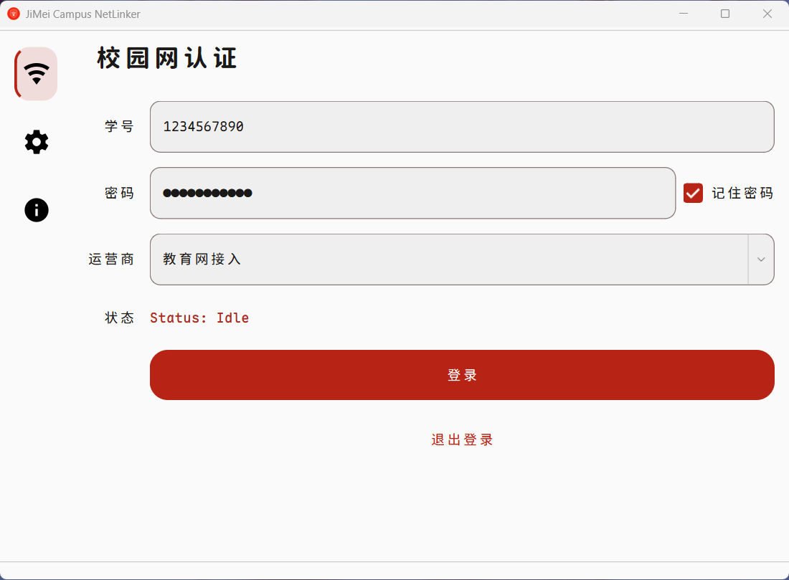

# JiMei Campus NetLinker

集美大学校园网认证客户端

## 截图

| 校园网认证 |
|:---:|
|  |

## 功能

### 校园网认证

- Eportal 校园网登录 / 退出，支持教育网、电信、联通、移动四种运营商

### 高级设置

- 物理网卡识别与选择（优先以太网 / WLAN）
- 随机静态 IP 分配
- 一键恢复动态IP（DHCP）
- IP 分配历史记录查看、删除
- 需要以管理员权限运行

## 构建

### 依赖

- Qt 6.10+（Widgets / Network / Sql）
- MinGW 64-bit
- CMake ≥ 3.16
- 需要管理员权限（netsh）

### 编译

```bash
cmake -B build -DCMAKE_PREFIX_PATH="<Qt6>/mingw_64" -G "MinGW Makefiles"
cmake --build build
```

### 打包

```bash
build_release.bat
```

## Credit

本项目参考了 [jmuEportalAuth](https://github.com/openjmu/jmuEportalAuth)。

## 许可

MIT
