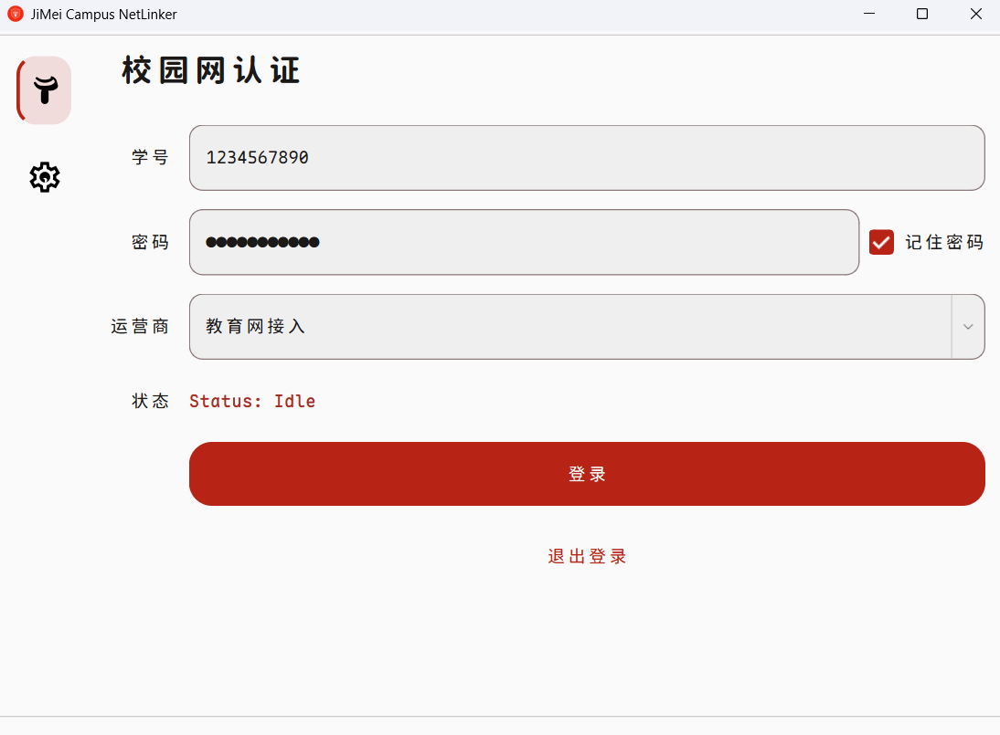
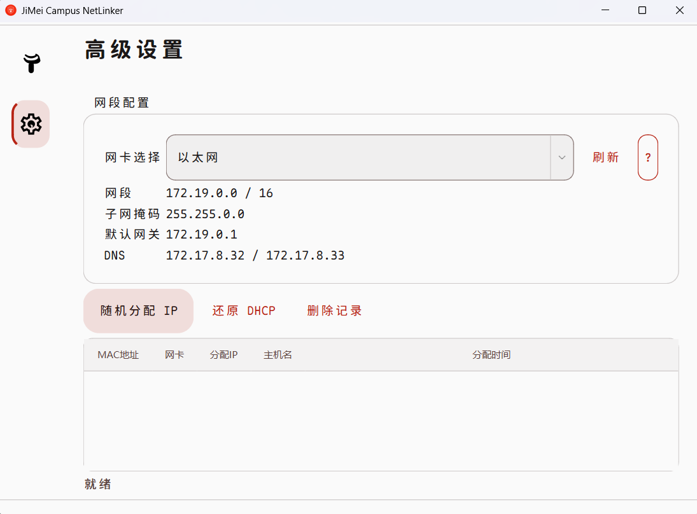

# JiMei Campus NetLinker

集美大学校园网认证客户端，基于 Qt 6.10.2、C++17、MinGW 64-bit。

Material Design 3 风格界面，JMU 红配色。

## 截图

| 校园网认证 | 高级设置 |
|:---:|:---:|
|  |  |

## 功能

### 校园网认证

- Eportal 校园网登录 / 退出，支持教育网、电信、联通、移动四种运营商
- 记住密码（Windows DPAPI 加密存储）
- 在线状态自动检测（60s 轮询），断网自动重连（最多 3 次）
- 系统托盘最小化、开机自启

### 高级设置

- 物理网卡识别与选择（优先以太网 / WLAN）
- 随机静态 IP 分配（172.19.0.0/16 网段，SQLite 防冲突）
- 一键还原 DHCP
- IP 分配历史记录查看、删除、导出

## 构建

### 依赖

- Qt 6.10+（Widgets / Network / Sql）
- MinGW 64-bit
- CMake ≥ 3.16
- 需要管理员权限（netsh）

### 编译

```bash
cmake -B build -DCMAKE_PREFIX_PATH="<Qt6>/mingw_64" -G "MinGW Makefiles"
cmake --build build
```

### 打包

```bash
build_release.bat
```

## 架构

```
JMCampusNetLinker/
├── main.cpp                # 入口：字体加载、主题应用、窗口启动
├── mainwindow.ui           # 主窗口 UI（Navigation Rail + QStackedWidget）
├── MainWindow.h/cpp        # 主窗口：认证调度、托盘、自启、在线监控
├── NavigationRail.h/cpp    # Material 3 左侧导航栏（仅图标）
├── EportalAuth.h/cpp       # Eportal HTTP 认证（登录 / 登出）
├── NetworkChecker.h/cpp    # 在线状态探测（HTTP GET → 204）
├── IpManager.h/cpp         # netsh 静态 IP 管理（QThread worker）
├── IpManagerWidget.h/cpp   # 高级设置页 UI
├── IpRecord.h/cpp          # SQLite IP 分配记录
├── ThemeManager.h/cpp      # M3 色调色板引擎（30 个颜色令牌、QSS 变量替换）
├── theme.qss               # Material You 全局样式表
├── resources.qrc           # 图标资源
├── fonts/                  # Maple Mono CN / NF CN 字体
└── nav_*.svg               # 导航栏 SVG 图标
```

### 数据流

```
登录：MainWindow → EportalAuth::login()
      → GET 探测页 → POST 凭证 → 解析结果
      → NetworkChecker 持续监控 → 断网 → AutoRelogin

IP 分配：IpManagerWidget → IpManager::assignRandomIp()
         → QMetaObject::invokeMethod → IpWorker (QThread)
         → netsh interface ip set address ...
         → IpRecord 写入 SQLite
```

### 主题

`ThemeManager` 从种子色（默认 `#D23B2C` JMU 红）生成完整 Material 3 色调色板——Primary、Secondary、Tertiary、Surface、Error 五大色系共 30 个颜色令牌。`theme.qss` 中所有颜色通过 `{{M3Primary}}` 等占位符引用，启动时自动替换。

## 许可

MIT
